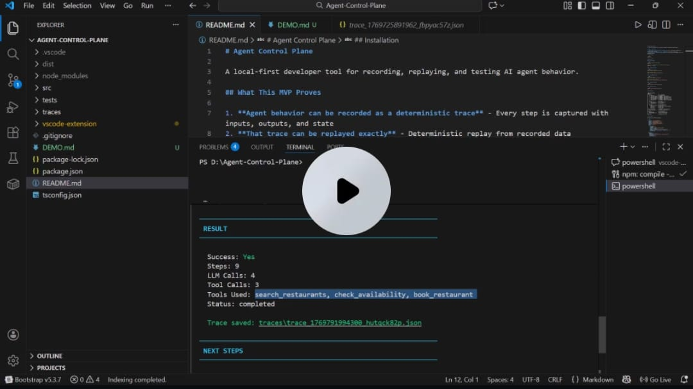
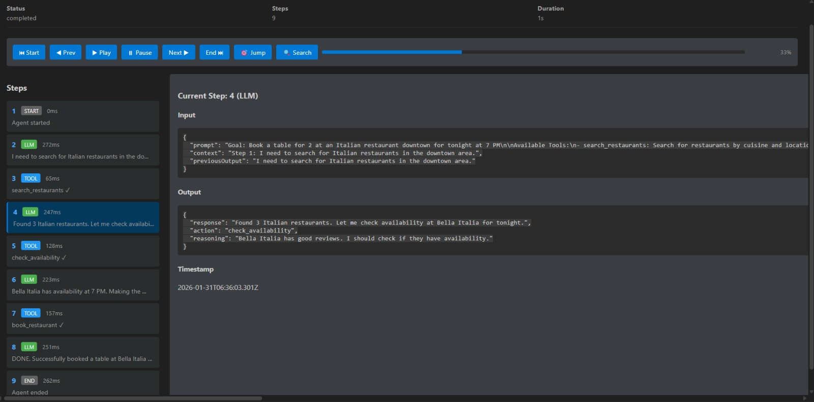
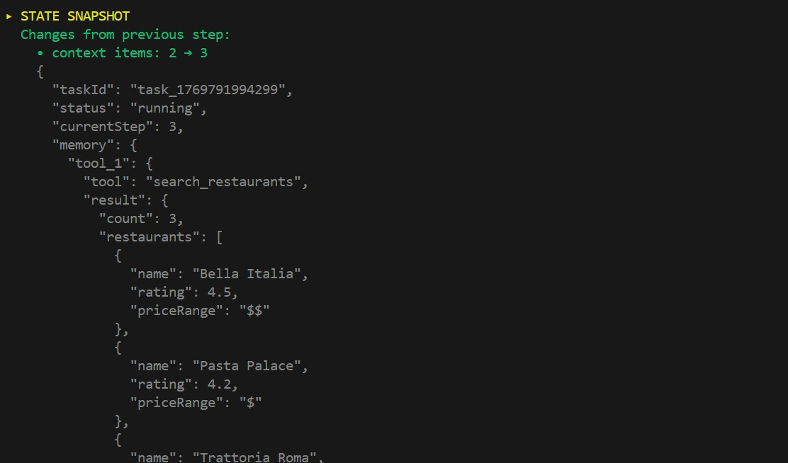
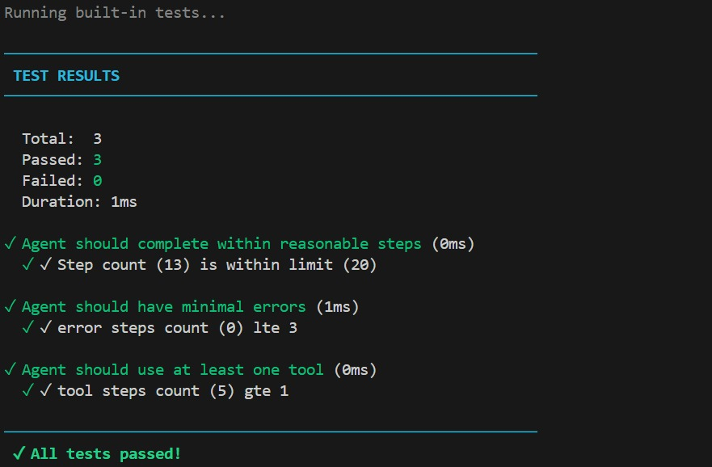
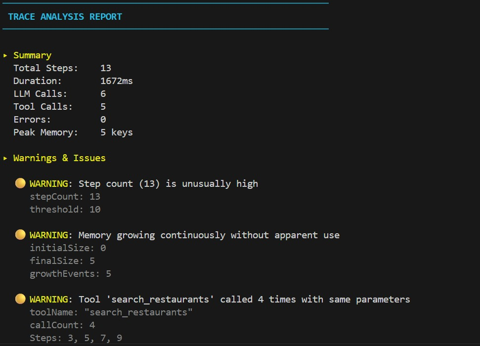
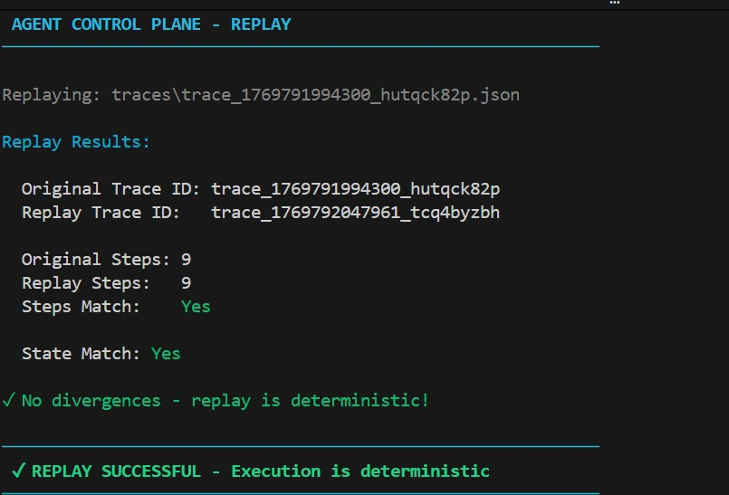
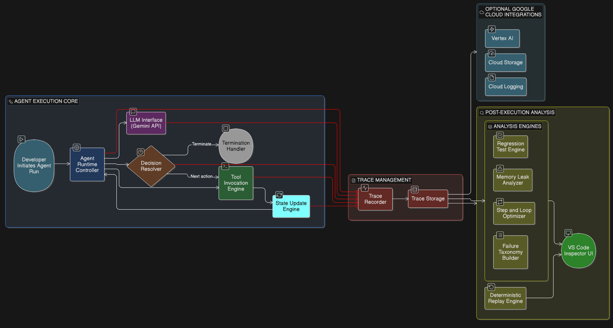

# Agent Control Plane    


A **developer-grade control plane** for recording, replaying, inspecting, and testing AI agent behavior as **first-class, deterministic artifacts** — not opaque logs.

## Demo Video

[](https://youtu.be/UMdowkXcTN0)

> Click the thumbnail to watch a full demo showcasing trace recording, deterministic replay,
> behavioral testing, and step-by-step inspection.

---

## Trace Inspector UI



> The Trace Inspector provides step-by-step navigation through agent execution,
> exposing inputs, outputs, tool calls, state snapshots, and timing information
> for each step.

## Execution, Testing & Replay

The following screenshots are real outputs generated by Agent Control Plane during
a single agent run, demonstrating state tracking, behavioral testing, analysis,
and deterministic replay.

### State Snapshot Tracking



> Shows structured state changes between steps, including memory growth,
> context updates, and tool outputs. This makes agent decision paths explicit
> and debuggable.

### Behavioral Test Results



> Behavioral tests validate agent behavior such as step limits, tool usage,
> and error rates without relying on fragile text matching.


### Trace Analysis Report



> Post-execution analysis highlights inefficiencies like excessive steps,
> repeated tool calls, and continuous memory growth.


### Deterministic Replay



> Replay confirms that the same trace produces identical steps and final state,
> guaranteeing deterministic execution and reliable regression testing.


## Architecture Overview



> High-level architecture showing agent execution, trace recording,
> post-execution analysis engines, deterministic replay, and VS Code
> inspector integration.


---

## Table of Contents

- [Why Agent Control Plane Exists](#why-agent-control-plane-exists)
- [Core Guarantees](#core-guarantees)
- [Quick Start](#quick-start)
- [Architecture Overview](#architecture-overview)
- [Project Structure](#project-structure)
- [Trace Format](#trace-format)
- [Behavioral Testing](#behavioral-testing)
- [Behavioral Analysis Engine](#behavioral-analysis-engine)
- [VS Code Extension](#vs-code-extension)
- [Success Metrics & Roadmap](#success-metrics--roadmap)
- [Security & Privacy](#security--privacy)
- [Definition of Done](#definition-of-done)
- [License](#license)

---

## Why Agent Control Plane Exists

Modern AI agents are **non-deterministic, opaque, and fragile to change**.

This leads to:
- Failures that cannot be reproduced
- Silent regressions after prompt or model changes
- Debugging via logs instead of actual decision paths
- No reliable CI/CD story for agent-based systems

**Agent Control Plane** solves this by treating every agent run as a **deterministic execution trace** that can be replayed, inspected, tested, and analyzed — enabling real debugging, regression testing, and confidence when shipping changes.

---

## Core Guarantees

1. **Deterministic Execution**  
   Every agent run is captured as a complete, ordered, immutable trace.

2. **Exact Replay**  
   Any trace can be replayed step-by-step without calling live LLMs.

3. **Behavioral Testing**  
   Tests assert *what the agent did* (tools, steps, state), not fragile text output.

4. **Full Step Inspection**  
   Each step exposes inputs, outputs, memory snapshots, timing, and metadata.

---

## Quick Start

### 1. Install Dependencies

```bash
npm install
```
2. Run the Agent (Generate a Trace)
bash
```
npm start
```
Run a deliberately broken scenario to validate testing and analysis:

```
npm start -- --broken
```
3. Inspect the Trace

```
npm run inspect traces/<trace-file>.json
```
Inspect a specific step:

```
npm run inspect traces/<trace-file>.json 3
```
4. Run Behavioral Tests
bash
Copy code
npm run test traces/<trace-file>.json
Run custom YAML-based tests:
```
npm run test traces/<trace-file>.json tests/basic.yaml
```
5. Analyze for Issues
```
npm run analyze traces/<trace-file>.json
```
6. Replay the Trace
```
npm run replay traces/<trace-file>.json
```


## Architecture Overview

### Execution Flow

1. Agent runtime executes steps (LLM calls, tool calls, internal logic)

2. Trace recorder captures each step with timestamps and state snapshots

3. Trace is persisted as a deterministic JSON artifact

4. Replay engine re-executes from trace data

5. Test engine and analyzer operate on the trace

6. VS Code extension provides interactive inspection

```

Agent Runtime
   ↓
Trace Recorder → traces/*.json
   ↓
Replay Engine / Test Engine / Analyzer / Inspector / VS Code Extension
Project Structure
powershell
Copy code
Agent-Control-Plane/
├── src/
│   ├── core/
│   │   ├── types.ts
│   │   ├── trace-recorder.ts
│   │   ├── agent-runtime.ts
│   │   ├── replay-engine.ts
│   │   ├── step-inspector.ts
│   │   ├── test-engine.ts
│   │   └── analyzer.ts
│   ├── cli/
│   │   ├── inspect.ts
│   │   ├── test-runner.ts
│   │   └── analyze.ts
│   └── agent/
│       ├── llm-provider.ts
│       ├── tools.ts
│       ├── run.ts
│       └── replay.ts
├── vscode-extension/
│   └── src/extension.ts
├── tests/
│   ├── basic.yaml
│   └── broken-agent.yaml
└── traces/
```

### Trace Format
```
{
  "traceId": "trace_1234567890_abc",
  "agentId": "restaurant-booking-agent",
  "taskId": "task_1234567890",
  "startTime": "2024-01-15T10:00:00.000Z",
  "endTime": "2024-01-15T10:00:05.000Z",
  "status": "completed",
  "steps": [
    {
      "stepNumber": 1,
      "stepType": "llm",
      "timestamp": "2024-01-15T10:00:01.000Z",
      "input": { "prompt": "..." },
      "output": { "response": "...", "action": "search" },
      "stateSnapshot": { "currentStep": 1, "memory": {} },
      "duration": 150
    }
  ],
  "metadata": {
    "agentVersion": "1.0.0",
    "toolsUsed": ["search_restaurants", "book_restaurant"],
    "totalLLMCalls": 4,
    "totalToolCalls": 3
  }
}
```
### Trace Guarantees

- Steps are strictly ordered and immutable

- Traces are append-only and self-contained

- Replay does not depend on live LLM calls

- State is captured before and after each step

### Behavioral Testing

Example tests/basic.yaml:

```
tests:
  - name: "Tool Should Be Called"
    assertions:
      - type: tool_called
        params:
          tool: search_restaurants
          minTimes: 1

  - name: "Step Limit"
    assertions:
      - type: max_steps
        params:
          count: 10
```
### Supported Assertions

| Type               | Description                  |
|--------------------|------------------------------|
| `tool_called`      | Tool must be called          |
| `tool_not_called`  | Tool must not be called      |
| `max_steps`        | Enforce max steps            |
| `min_steps`        | Enforce min steps            |
| `state_contains`   | State contains value         |
| `state_not_contains` | State excludes value       |
| `step_type_count`  | Count step types             |

**Why this matters:** Tests remain stable across prompt edits and model upgrades.


---

## Behavioral Analysis Engine

#### The analyzer detects:

- high_step_count — loops or inefficiencies

- memory_growth — memory accumulation

- repeated_tool_calls — duplicate invocations

- unused_memory — state written but never read

- long_duration — slow steps

- error_rate — frequent failures

- Each warning includes severity, affected steps, and remediation hints.


--- 
## VS Code Extension

#### Features:

- Workspace trace explorer

- Step-by-step trace inspection

- State diffs

- Integrated analysis

### Commands:

```
ACP: Open Trace File

ACP: Show Trace Inspector

ACP: Analyze Current Trace

ACP: Run Agent
```

Note: Live tracing and inline assertions are planned.

--- 

## Success Metrics & Roadmap

| Metric                   | Status  |
|--------------------------|---------|
| Deterministic replay     | ✅      |
| Full step inspection     | ✅      |
| Behavioral tests         | ✅      |
| Regression detection     | ✅      |
| CI integration           | 🚧      |
| Trace diffing            | Planned |
		

--- 

## Roadmap
- CI/CD helpers

- Trace diff visualization

- Live execution tracing

- Multi-agent correlation

- Distributed replay

## Security & Privacy
- Traces may contain sensitive inputs

- Default storage is local-only

- Redaction hooks supported

- Replay runs sandboxed by default


## Definition of Done
- Agent produces a trace

- Trace replays deterministically

- Any step can be inspected

- Behavioral regressions are detected
 
- Failures are explainable via trace
--- 
License
MIT

For the google hack
